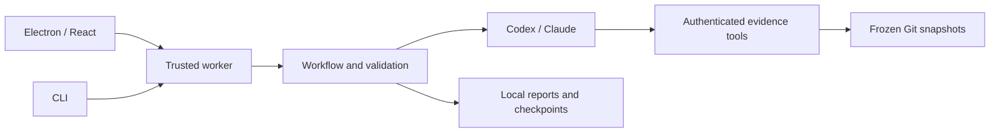

# Aiden

> **💬 [Join the Aiden Slack community](https://join.slack.com/t/aidenbyopheleon/shared_invite/zt-4apsg5d7p-FDO9ae0imxj~KgauP8lpsw)**
>
> Get setup help, ask questions, and share feedback with the Aiden team.

**Understand what is built, what remains, and the evidence behind the estimate.**

Aiden is a local desktop app and CLI for developers reviewing work across Git repositories. It compares reviewed requirements with committed code, links findings to exact snapshots and lines, and estimates original and remaining scope. Optional issue-tracker history provides time ranges from comparable completed work.

**Pre-release · Apple Silicon macOS · Apache 2.0.** Public beta preparation is in progress; signed installation and upgrade verification remain release requirements.


_The screenshot uses a deterministic fixture provider. [Example reports](examples/reports/README.md) contain separately recorded model output about synthetic repositories._

[Install](#install) · [Quick start](#quick-start) · [Providers](#providers) · [Privacy](#privacy) · [Development](#development) · [Architecture](#architecture) · [Support](#support-and-contributing) · [License](#license)

## Install

Use [GitHub Releases](https://github.com/opheleon/aiden-preview/releases) for published installers. Requirements: Apple Silicon macOS, Git, and a supported provider runtime/account. Windows/Linux installers and Intel macOS are outside the beta scope. If no suitable signed release is available, use the development setup below.

Download the DMG and `SHA256SUMS.txt` from the same release, verify them, then open the DMG and drag Aiden into Applications. Replace the example filename with the downloaded filename:

```sh
shasum -a 256 -c SHA256SUMS.txt --ignore-missing
gh attestation verify Aiden-VERSION-arm64.dmg --repo opheleon/aiden-preview
```

Installed builds check GitHub Releases 30 seconds after launch and every 12 hours while open. Updates download automatically by default; this can be disabled under **Settings → Desktop app**. Restart explicitly to apply a downloaded update; ordinary quitting does not install it. Stable builds follow stable releases; beta builds and users who opt in under **Settings → Desktop app** can receive betas. Aiden retains the Opheleon bundle identity; avoid running both copies simultaneously. Maintainers: see the [release runbook](docs/macos-release.md) for signing, notarization, compatibility, and release gates.

To uninstall, quit and remove the app. Projects and reports remain in `~/.aiden` (or `AIDEN_HOME`); back it up before deleting it. Provider sign-in and OS credential-store entries are managed separately. Disconnect integrations before uninstalling to remove their credentials.

## Quick start

1. Select a provider and choose subscription or API-key authentication.
2. Choose your project folder and review the discovered Git repositories.
3. Paste project context or import Markdown/text.
4. Review and edit the extracted requirements, then approve the baseline.
5. Refresh status and inspect each requirement's status, code evidence, and limitations.
6. Optionally open **Estimates** to size the remaining work. Connect a ticket source for time ranges based on recent comparable work. No usable ticket history means no time estimate.
7. Export JSON or Markdown.

Only committed snapshots are assessed. Clean repositories may fast-forward to their configured upstream; dirty, diverged, detached, or unavailable repositories are preserved with freshness warnings. Rescan when adding repositories.

Change the saved provider/model under **Settings → Model**. Local daily/weekly schedules are available under **Settings → Schedule**; Aiden must stay open and awake. Missed runs are skipped, and reviewed requirements are required before scheduling.

Model judgments can be wrong. Validation checks report structure and inspected evidence; it cannot prove a conclusion or production deployment. Forecasts remain unavailable when evidence or comparable history is insufficient.

## Providers

| Mode                 | Status                                                                  |
| -------------------- | ----------------------------------------------------------------------- |
| Codex subscription   | Implemented; fresh-install and public-distribution verification pending |
| Codex API key        | Implemented; live verification incomplete                               |
| Claude subscription  | Implemented via Agent SDK; uses your own Claude Code sign-in            |
| Claude API key       | Implemented; live verification incomplete                               |
| Linear read-only MCP | OAuth/history implemented; live account verification incomplete         |
| Custom hosted MCP    | Experimental; explicit approval required for read tools                 |

Codex requires a separate [Codex CLI installation](https://learn.chatgpt.com/docs/codex/cli), even in API-key mode. Installing the Codex desktop app alone does not make its CLI available to Aiden. For a standard Homebrew installation, use `brew install --cask codex`, then restart Aiden and select **Sign in with Codex**. The setup screen links to the official installation guide when the CLI is missing.

For Claude subscription mode, install Claude Code separately and run `claude auth login --claudeai`. Aiden prefers that installation so its existing sign-in can be reused; the packaged SDK also includes a native Claude runtime. Select the intended authentication method, then use **Check connection**. If it fails, check runtime availability and account sign-in. Aiden uses that selected billing mode; provider usage limits and charges apply, and Aiden includes no model credits. API keys entered in the app are session-only and must be supplied again after restart.

On macOS, Aiden searches the inherited PATH plus `/opt/homebrew/bin`, `/usr/local/bin`, and `~/.local/bin`, including when opened from Finder. For a custom Codex installation, set `AIDEN_CODEX_BINARY` to its executable path in Aiden's launch environment; npm-based installations also need Node available on PATH.

## Privacy

- Project metadata, requirements, snapshots, checkpoints, and reports stay under `~/.aiden`, or `AIDEN_HOME`.
- Selected context and code evidence are sent to your chosen model provider. Inference is not offline.
- Provider credentials stay in trusted processes/provider storage. Integration credentials use the OS credential store, with an explicit session-only fallback.
- The renderer uses an allowlisted bridge. Repository files are untrusted evidence; provider executables are not isolated in a VM.
- Aiden does not collect usage metrics or upload diagnostics. The newest 100 coarse startup, worker, and renderer failure records stay in `~/.aiden/diagnostics/events.json`; they exclude error messages, source, prompts, reports, and private paths.
- Update checks and downloads contact the release host. Provider and integration requests follow your selected connections and actions.

Snapshots may contain private code: protect the data directory and never commit it. See [SECURITY.md](.github/SECURITY.md) for private vulnerability reporting and the [architecture guide](docs/architecture.md#trust-boundaries) for security boundaries.

## Development

Use Node from `.node-version` and the exact pnpm version in `package.json`:

```sh
pnpm install --frozen-lockfile
pnpm dev
```

The dependency policy applies a 14-day release cooldown, rejects provenance downgrades, and denies unreviewed install scripts. Review [dependency security](docs/dependency-security.md) before changing the lockfile or granting an exception.

```sh
pnpm check             # formatting, lint, types, boundaries, coverage, build
pnpm test              # deterministic backend tests
pnpm test:coverage     # backend coverage report
pnpm test:renderer     # renderer behavior and coverage
pnpm test:desktop      # build, Electron journeys, and UI smoke tests
pnpm build             # production build
```

Desktop tests use synthetic provider output through the real Electron/worker boundary and need no provider credentials. They cover analysis, evidence, export, restart, and recovery. Screenshots and traces go to ignored `test-results/`. After building, `pnpm test:desktop:journeys` runs just the journeys. Integration tests need loopback networking; desktop tests need macOS GUI access.

Live checks require provider sign-in and consume quota: `pnpm test:e2e`, `pnpm smoke -- codex`, or `pnpm smoke -- claude --api-key`.

For the CLI, first edit repository paths in `examples/project.json`:

```sh
pnpm cli -- doctor
pnpm cli -- discover --root /absolute/project/folder
pnpm cli -- report --config examples/project.json --format json --out report.json
```

To check approved requirements against a running web app (prototype), open the project in the desktop app and save its URL under **App URL** on the overview. From then on, **Refresh status** assesses the code and then tests each approved requirement in a browser. **Check now** in the App URL panel runs only the browser check. Each requirement shows both results: **Implemented in code** comes from the code assessment, **Verified in browser** means Aiden used the app and saw it work, and **Fails in browser** means it saw it fail. A requirement that cannot be tested in the UI keeps its code status. **Watch recording** on a requirement opens its video, proof screenshot, and steps, and **Open full report** opens the standalone HTML report. The CLI below runs the same browser check. Each project keeps its own URL. It can be a localhost address or a beta site you control. Aiden opens the URL in its own browser and never runs your repository code. Run `pnpm exec playwright install chromium` once first.

```sh
pnpm cli verify-url --project my-project --url http://localhost:3000
pnpm cli verify --project my-project --out verification
```

`verify --url URL` checks a different address for one run; non-local addresses must be the saved app URL. `verify-url --project ID` shows the saved URL, and `--clear` removes it.

## Architecture



| Location                                    | Responsibility                                   |
| ------------------------------------------- | ------------------------------------------------ |
| `apps/desktop`, `apps/cli`                  | Desktop and terminal interfaces                  |
| `packages/core`                             | Worker, workflows, checkpoints, storage          |
| `packages/contracts`                        | Schemas, API types, evidence validation          |
| `packages/tools`, `packages/integrations`   | Guarded Git, evidence, approved hosted MCP reads |
| `packages/runtimes`                         | Provider execution and authentication            |
| `packages/estimation`, `packages/reporting` | Estimation rules and report rendering            |
| `workflows/v1`                              | Versioned model instructions                     |

Executable source is TypeScript; the Electron preload compiles to CommonJS. Read [architecture and protocol](docs/architecture.md) for the engine, trust boundaries, and persistence details.

## Support and contributing

Join the [Aiden by Opheleon Slack community](https://join.slack.com/t/aidenbyopheleon/shared_invite/zt-4apsg5d7p-FDO9ae0imxj~KgauP8lpsw), also linked in the app. Use [GitHub issues](https://github.com/opheleon/aiden-preview/issues) for reproducible bugs, feature proposals, and planned work.

Read [CONTRIBUTING.md](.github/CONTRIBUTING.md), [SUPPORT.md](.github/SUPPORT.md), and the [code of conduct](.github/CODE_OF_CONDUCT.md). Never post credentials, private code, or reports in public issues. See [CHANGELOG.md](CHANGELOG.md) for changes and the [release gates](docs/macos-release.md#beta-readiness) for remaining beta work.

## License

Copyright © 2026 Opheleon. Aiden source is licensed under [Apache 2.0](LICENSE). See [NOTICE](NOTICE) and [third-party notices](THIRD_PARTY_NOTICES.md). Dependencies, fonts, provider binaries, trademarks, and connected services retain their own licenses or terms; Aiden's license grants no provider account access or usage credits.
