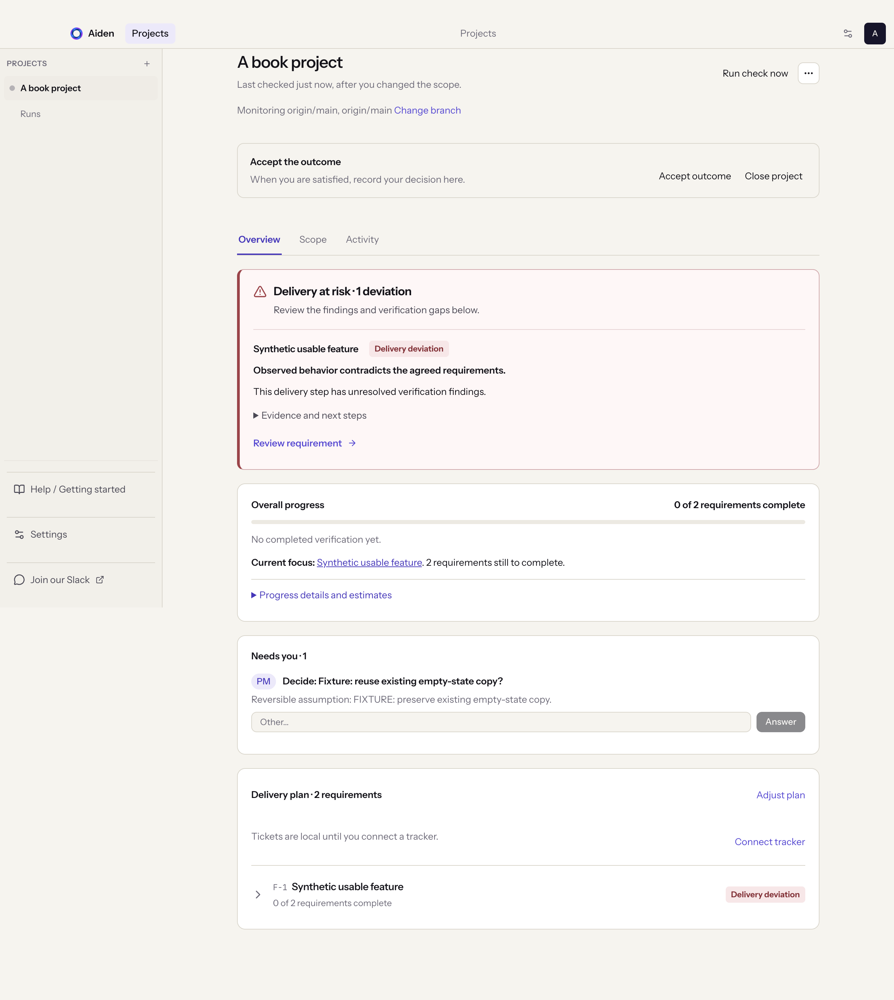
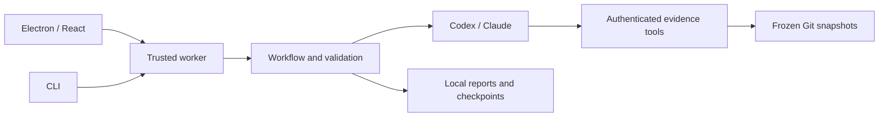

# Aiden

> **💬 [Join the Aiden Slack community](https://join.slack.com/t/aidenbyopheleon/shared_invite/zt-4apsg5d7p-FDO9ae0imxj~KgauP8lpsw)**
>
> Get setup help, ask questions, and share feedback with the Aiden team.

**Understand what is built, what remains, and the evidence behind the estimate.**

Aiden is a local desktop app and CLI for developers reviewing work across Git repositories. It compares reviewed requirements with committed code, links findings to exact snapshots and lines, and estimates original and remaining scope. Optional issue-tracker history provides time ranges from comparable completed work.

**Pre-release · Apple Silicon macOS · Apache 2.0.** Public beta preparation is in progress; signed installation and upgrade verification remain release requirements.



_The screenshot uses a deterministic fixture provider. [Example reports](examples/reports/README.md) contain separately recorded model output about synthetic repositories._

[Install](#install) · [Quick start](#quick-start) · [Providers](#providers) · [Privacy](#privacy) · [Development](#development) · [Architecture](#architecture) · [Support](#support-and-contributing) · [License](#license)

## Delivery ownership

Aiden’s product direction is to automate the project-manager function: coordinate delivery between humans and agents toward agreed outcomes and timing. It should form a plan, advance authorized work, verify results, and surface the decisions and blockers that need a person. The interface should make its direction and evidence legible with minimal supervision.

Setup now creates an ordered delivery plan automatically. Each step delivers a usable vertical feature with its requirements, edge cases, and hard prerequisites. Significant shared platform work is explicit and bounded, with a concrete test plan covering consumer integration, expected results, and failure or rollback checks before dependent work proceeds. The desktop saves this plan and starts checking without an approval gate; **Adjust plan** is available when the order, grouping, or dependencies need changing. Existing projects retain their scope and order until **Plan delivery** is used.

The overview shows completion, the current feature, code versus app verification, agreed milestones, and code-assessment changes. Actions and verification gaps live within their requirement; project-wide actions and open decisions stay visible under **Needs you**. After each successful planned code check, Aiden sizes remaining work automatically. Sizing uses the configured provider and can consume its normal quota. Unknown effort stays unknown; complexity points are not a duration or a promised finish date.

This version plans, checks, sizes defined scope, and writes local delivery tickets linked inside their requirements. Coding-agent dispatch is an optional beta capability, off by default, with explicit per-job submission after opt-in. Unknown core behavior blocks affected requirements and dependent features; independent investigation can continue. Project-wide sizing waits for blocking decisions. Scheduled monitoring still requires the desktop app to be open. Browser checks remain evidence of observed behavior, distinct from code assessment.

## Install

Use [GitHub Releases](https://github.com/opheleon/aiden-preview/releases) for published installers. Requirements: Apple Silicon macOS, Git, and a supported provider runtime/account. Windows/Linux installers and Intel macOS are outside the beta scope. If no suitable signed release is available, use the development setup below.

Download the DMG and `SHA256SUMS.txt` from the same release, verify them, then open the DMG and drag Aiden into Applications. Replace the example filename with the downloaded filename:

```sh
shasum -a 256 -c SHA256SUMS.txt --ignore-missing
gh attestation verify Aiden-VERSION-arm64.dmg --repo opheleon/aiden-preview
```

Installed builds check GitHub Releases 30 seconds after launch and every 12 hours while open. Updates download automatically by default; this can be disabled under **Settings → Desktop app**. Restart explicitly to apply a downloaded update; ordinary quitting does not install it. Stable builds follow stable releases; beta builds and users who opt in under **Settings → Desktop app** can receive betas. Aiden retains the Opheleon bundle identity; avoid running both copies simultaneously. Maintainers: see the [release runbook](docs/macos-release.md) for signing, notarization, compatibility, and release gates.

To uninstall, quit and remove the app. Projects and reports remain in `~/.aiden` (or `AIDEN_HOME`); back it up before deleting it. Provider sign-in and OS credential-store entries are managed separately. Disconnect integrations before uninstalling to remove their credentials.

Each project has a **Branch monitoring** setting under **Project settings**. It starts with the current branch's remote upstream, or the same-named branch on origin (or the sole configured remote), and remembers that selection independently of later local checkout changes. Choose another branch from the live remote list; saving starts a fresh check and clears current results from the previous selection while preserving history. Unpushed, deleted, or inaccessible branches remain unverified. The overview shows the selection with a shortcut to change it. Projects sharing a repository can monitor different branches.

## Quick start

1. Say what you are building: type or paste anything that describes it, or import a Markdown/text file.
2. Choose the project folder. Aiden finds the Git repositories inside it, skipping folders a repository ignores (such as build output and old checkouts) and folding extra worktrees into their main checkout. When the folder holds several products, Aiden picks the repositories your intent is about and looks only at those.
3. Pick a provider, then **Hand it to Aiden**. Aiden names the project from its scoped outcome, so separate projects in the same folder remain distinguishable. Older projects use a short scope excerpt until their next scope rewrite. There is no review step: Aiden writes the requirements, with the edge cases that tend to break each one, and runs a check.
4. Start in **Overview** for progress, current focus, and **Needs you**. Expand a delivery step, then a requirement for its linked delivery ticket, actions, risks, and evidence; expand **Progress details and estimates** for sizing and timing. Project tabs separate **Scope**, **Activity** (with **Why?** on each step), and **Coding**, which appears when dispatch is enabled or saved jobs exist.
5. Runs waiting for scope decisions show **Blocked** or **Partly blocked**, and the run details let you answer directly. A completed investigation does not mean blocked delivery is ready. Decisions are PM action items. Blocking decisions pause affected requirements and dependent features; each names the question, owner, and what an answer unlocks. Only low-impact reversible choices may proceed on an explicit assumption. Answering updates scope and starts a new check. Manual tests are PM action items too; mark them **Done** and they come back after the next check, since new code needs testing again.
6. Edit the scope or the goal at any time; Aiden checks again. Export JSON or Markdown from the **More** menu.

While Aiden is open it reads each repository's selected remote-branch commit every minute (without changing local refs or files) and checks again when that remote branch changes, plus once each morning if it has not checked that day. Action items update with every check, so fixed work leaves the list on its own. **More → Run check now** starts a check straight away and picks up one that stopped early.

Choose a model and reasoning effort before handing off a project under **Model and effort**. Claude model discovery shows the resolved model ID and advertised effort levels from the installed Claude Code runtime. Selections persist per project and apply to future runs. Update Claude Code to refresh newly available models.

Change the saved provider/model under **Settings → Model**, and the project folder, app URL, and context connections under **Settings → Project**.

Model judgments can be wrong. Validation checks report structure and inspected evidence; it cannot prove a conclusion or production deployment. Forecasts remain unavailable when evidence or comparable history is insufficient.

## Automatic tracker tickets

Only one publishing connection is needed per tracker account. **Connect Linear** reuses the saved read/write connection instead of creating another entry. The project dropdown labels connection readiness and excludes older read-only Linear entries; those remain under **Older read-only Linear connections** in Integrations for existing context links. OAuth sign-in uses the OS credential store by default. Aiden restores the connection when next needed after restart, and the MCP SDK renews expired access tokens using the saved refresh token. Explicit session-only authentication or an unavailable credential store requires sign-in after quitting; Settings shows which storage is in use. If consent is revoked or refresh fails, choose **Reconnect Linear** beside the dropdown and complete browser sign-in; the page updates automatically. Older session-only connections need one sign-in with this version to save reusable credentials.

Use **Connect tracker** on the project’s delivery plan, then **Manage tracker connections** to connect **Linear** or **Jira**. Return to the project, choose the connection, and open the **Linear team** dropdown to load your available teams. Select a team, enable automatic tickets, and choose **Create project and publish tickets**. Aiden creates one Linear project named from this Aiden project’s scope, verifies its team and identity, then publishes its tickets there. Subsequent publishing and syncs reuse that project, even when other Aiden projects share its display name. Existing tracker destinations are preserved; Jira continues to use its configured project. Existing local tickets publish even when you connect later. **Sync tickets** reconciles the same issues on demand and shows updated status immediately; **Publishing settings** lets you pause or resume automatic publishing. These settings also remain available under **Settings → Project → Automatic tickets**. Requirements and their ticket live in one expandable hierarchy. Requirements in a shared vertical feature link to the same issue rather than duplicate issues. Aiden publishes one issue per ordered delivery feature, includes prerequisite ticket links, reads every write back, and checks status every minute while the app is open and the project is idle. Saving scope and completing a code look also reconcile tickets. Code monitoring reads the selected remote branch every minute, without updating the local checkout. Delivery assessments fetch that exact remote commit into private Git refs and frozen evidence; local commits and feature branches do not count as merged. Missing remote access leaves merge verification unavailable. A tracker status change queues a fresh code assessment; the first successful read of an already completed or canceled ticket also queues one. Neither proves acceptance checks passed. Linear project UUIDs are used for ticket membership checks; older short project identifiers are reconciled against the same project, team, and ownership marker before syncing.

**Delivery attention** appears above Overview progress when a completed ticket disagrees with requirement evidence or assessed behavior contradicts scope. A fresh assessment is shown as **Checking completion**; missing access, failed assessments, or outstanding acceptance checks show **Completion unverified**. Confirmed missing, partial, or contradictory work shows **Delivery deviation**, including affected dependent delivery steps. The same label appears on collapsed features and requirements. Expand **Evidence and next steps**, choose **Review requirement** to open its details, or follow the linked ticket. Ticket status stays owned by the tracker; resolving the evidence clears the finding.

Blocking decisions publish as clearly marked draft scope, including affected dependent features, without invented implementation steps. Scope and evidence changes update managed ticket content. If a person changes that content, Aiden surfaces a conflict instead of overwriting it. Status and assignment remain owned by the tracker. Removing a feature preserves its issue for review. Pausing automatic tickets stops future syncs and is available even if the tracker is offline.

Use the [Linear read/write MCP endpoint](https://linear.app/docs/mcp), rather than its read-only endpoint. The Jira preset uses Atlassian's [flat MCP tool catalog](https://developer.atlassian.com/cloud/rovo-mcp/guides/supported-tools/); your account needs the relevant read, search, and write permissions. Aiden validates the discovered contracts before publishing. Unsupported server schemas and required Jira custom fields stop setup with an error. Existing read-only connections remain read-only until you connect the appropriate endpoint.

Linear project identities, ticket mappings, and pending writes persist across restarts. A timed-out project creation is reconciled using its saved recovery marker; Aiden does not blindly create another project. Missing project permissions, incomplete team or project discovery, and changed tool contracts are surfaced before publishing. After an ambiguous create, Aiden searches for its stable identity marker rather than blindly creating another issue. Missing markers, scope mismatches, duplicate matches, or manual edits need review in the tracker. Restore the last managed content and identity marker to resume automatic updates. Destination changes are refused once tickets have been recorded, preventing accidental copies to another project. These adapters have synthetic MCP coverage; compatibility with your live account is established by the first successful read-back check. Coding-agent dispatch remains a separate, default-off beta setting.

## Providers

| Mode                 | Status                                                                  |
| -------------------- | ----------------------------------------------------------------------- |
| Codex subscription   | Implemented; fresh-install and public-distribution verification pending |
| Codex API key        | Implemented; live verification incomplete                               |
| Claude subscription  | Implemented via Agent SDK; uses your own Claude Code sign-in            |
| Claude API key       | Implemented; live verification incomplete                               |
| Linear read-only MCP | OAuth/history implemented; live account verification incomplete         |
| Custom hosted MCP    | Experimental; explicit approval required for read tools                 |

Codex requires a separate [Codex CLI installation](https://learn.chatgpt.com/docs/codex/cli), even in API-key mode. Installing the Codex desktop app alone does not make its CLI available to Aiden. For a standard Homebrew installation, use `brew install --cask codex`, then restart Aiden and select **Sign in with Codex**. The setup screen links to the official installation guide when the CLI is missing.

For Claude subscription mode, install Claude Code separately and run `claude auth login --claudeai`. Aiden prefers that installation so its existing sign-in can be reused; the packaged SDK also includes a native Claude runtime. Select the intended authentication method, then use **Check connection**. If it fails, check runtime availability and account sign-in. Aiden uses that selected billing mode; provider usage limits and charges apply, and Aiden includes no model credits. API keys entered in the app are session-only and must be supplied again after restart.

On macOS, Aiden searches the inherited PATH plus `/opt/homebrew/bin`, `/usr/local/bin`, and `~/.local/bin`, including when opened from Finder. For a custom Codex installation, set `AIDEN_CODEX_BINARY` to its executable path in Aiden's launch environment; npm-based installations also need Node available on PATH.

## Privacy

- Project metadata, requirements, snapshots, checkpoints, and reports stay under `~/.aiden`, or `AIDEN_HOME`.
- Selected context and code evidence are sent to your chosen model provider. Inference is not offline.
- Provider credentials stay in trusted processes/provider storage. Integration credentials use the OS credential store, with an explicit session-only fallback.
- The renderer uses an allowlisted bridge. Repository files are untrusted evidence; provider executables are not isolated in a VM.
- Aiden does not collect usage metrics or upload diagnostics. The newest 100 coarse startup, worker, and renderer failure records stay in `~/.aiden/diagnostics/events.json`; they exclude error messages, source, prompts, reports, and private paths.
- Update checks and downloads contact the release host. Provider and integration requests follow your selected connections and actions.

Snapshots may contain private code: protect the data directory and never commit it. See [SECURITY.md](.github/SECURITY.md) for private vulnerability reporting and the [architecture guide](docs/architecture.md#trust-boundaries) for security boundaries.

## Development

Use Node from `.node-version` and the exact pnpm version in `package.json`:

```sh
pnpm install --frozen-lockfile
pnpm dev
```

The dependency policy applies a 14-day release cooldown, rejects provenance downgrades, and denies unreviewed install scripts. Review [dependency security](docs/dependency-security.md) before changing the lockfile or granting an exception.

```sh
pnpm check             # formatting, lint, types, boundaries, coverage, build
pnpm test              # deterministic backend tests
pnpm test:coverage     # backend coverage report
pnpm test:renderer     # renderer behavior and coverage
pnpm test:desktop      # build, Electron journeys, and UI smoke tests
pnpm build             # production build
```

Desktop tests use synthetic provider output through the real Electron/worker boundary and need no provider credentials. They cover analysis, evidence, export, restart, and recovery. Screenshots and traces go to ignored `test-results/`. After building, `pnpm test:desktop:journeys` runs just the journeys. Integration tests need loopback networking; desktop tests need macOS GUI access.

Live checks require provider sign-in and consume quota: `pnpm test:e2e`, `pnpm smoke -- codex`, or `pnpm smoke -- claude --api-key`.

`pnpm eval:behavior claude 3` runs three independent live correction scenarios with Claude subscription billing (`codex` selects Codex subscription). It seeds a synthetic mistaken panel-removal baseline, applies a header-only correction through the production workflow, and checks scope/report consistency, code evidence, and rejection of an unrelated API endpoint. A separate tool-free model turn grades scope meaning; deterministic assertions remain mandatory. Every attempt is retained, including failures, with actual runtime identity and elapsed time. Output paths are printed; no existing project is edited. See [behavior evaluations](docs/behavior-evaluations.md).

For the CLI, first edit repository paths in `examples/project.json`:

```sh
pnpm cli -- doctor
pnpm cli -- discover --root /absolute/project/folder
pnpm cli -- report --config examples/project.json --format json --out report.json
```

Every run records each step it takes (each file it reads, each search, each browser action) and streams it as it happens. **Runs** under the project lists every run with live status and elapsed time; opening one shows its stages, what it is doing now, its full history, Stop, and the Why? conversation.

Beta checks (prototype): local testing belongs to the external coding agent. Normal code assessments do not probe localhost or start browser checks. Under **Settings → Project**, configure the beta app/API URL and enable **Post-merge beta verification**. The hourly or daily schedule runs while Aiden is open. A revision endpoint on the same HTTPS origin must return `{"commit":"full deployed Git SHA"}`. Aiden checks GitHub merge state and waits until beta includes that commit; a changed deployment during verification invalidates the run. Recorded evidence is labeled beta verification. Projects without a deployed UI/API can leave the schedule disabled.

By default, Aiden writes copyable local tickets inside the requirements of each delivery feature and saves `tickets.md` with each planning and assessment run. These are local artifacts, not issues published to an external tracker. Under **Settings → Project → Beta capabilities**, enable **experimental coding-agent dispatch** and save to reveal **External coding agent**. Choose a repository and explicitly submit a task. Disabling the setting prevents new jobs; saved jobs remain visible and active jobs can still be stopped. Blocking scope decisions prevent dispatch even when enabled. Aiden launches the installed Claude Code process through its SDK, preserving model, effort, and billing selection. Claude Code owns implementation, tool use, and local checks, using its automatic permission mode. Aiden supplies an isolated worktree, persists session/job identity, and validates the reported GitHub PR against its repository and branch. `gh` must be installed and authenticated. The first version supports Claude Code and github.com origins. Aiden does not merge or deploy. Permission blocks and incomplete outcomes remain visible; there is no silent paid retry. Quitting interrupts owned sessions and preserves their worktrees. On restart, orphaned jobs are marked interrupted. Inspect the saved session/worktree before explicitly dispatching again.

Agent completion immediately reconciles delivery state; a minute-based status check recovers missed events and polls review/CI/merge state. Use **Refresh** beside the project name to reconcile delivery and reload the latest saved evidence across the overview, plan, and activity. Refresh does not start coding or a code assessment; an enabled, due post-merge beta check can still begin through reconciliation. Once merged and deployed, Aiden starts the due beta check. Failed or inconclusive beta checks stay failed or unverified and retry on the configured schedule. Each check is linked to its job, reviewed scope, and deployed revision. Starting subsequent coding work remains an explicit user action; merge and deployment are external prerequisites.

```sh
pnpm cli verify-url --project my-project --url http://localhost:3000
pnpm cli verify --project my-project --out verification
```

`verify --url URL` checks a different address for one run; non-local addresses must be the saved app URL. `verify-url --project ID` shows the saved URL, and `--clear` removes it.

API checks (prototype): under **Settings → Project → API verification**, save the API base URL. Aiden can then check HTTP behavior even when there is no frontend. Requests are limited to that base, redirects are refused, and writes are off by default. For registration, login, or data changes, enable **Allow writes to this disposable test API** only on an isolated test instance. Test accounts and data may remain after a run. Existing worker-only test credentials are supported; returned tokens use opaque handles and are hidden in evidence.

**Watch** shows a recording of a simple HTTP results page with real requests, responses, and assertions. A pass needs deterministic assertions and a separate model review of coverage. The video is an explanation of API evidence, not proof of the app's UI. Inconclusive checks offer **Test by hand** and a report-scoped confirmation; demonstrated failures remain failing. Database hashing, external side effects, or unavailable expired-token fixtures may still need manual or integration tests. API attempts are not automatically retried, to avoid repeating writes. Completed criteria become watchable while later checks are running, and each API request reports progress. JWT negative tests can derive tampered-signature and unsigned variants through opaque handles. A genuinely expired signed token can be supplied through the worker-only `expiredToken` setting in the project’s private `verification.json` (mode 600), or `AIDEN_VERIFY_EXPIRED_TOKEN`; it never appears in the renderer or recordings. The fixture must belong to the configured disposable API. Without it, expiry remains unverified.

Run `pnpm eval:api claude` or `pnpm eval:api codex` for an opt-in live-model regression against a disposable API with working and deliberately broken authentication. See [behavioral evaluations](docs/behavior-evaluations.md) for evidence and limits.

## Architecture



| Location                                    | Responsibility                                                     |
| ------------------------------------------- | ------------------------------------------------------------------ |
| `apps/desktop`, `apps/cli`                  | Desktop and terminal interfaces                                    |
| `packages/core`                             | Worker, workflows, checkpoints, storage                            |
| `packages/contracts`                        | Schemas, API types, evidence validation                            |
| `packages/tools`, `packages/integrations`   | Guarded Git, evidence, approved MCP reads and scoped ticket writes |
| `packages/runtimes`                         | Provider execution and authentication                              |
| `packages/estimation`, `packages/reporting` | Estimation rules and report rendering                              |
| `workflows/v1`                              | Versioned model instructions                                       |

Executable source is TypeScript; the Electron preload compiles to CommonJS. Read [architecture and protocol](docs/architecture.md) for the engine, trust boundaries, and persistence details.

## Support and contributing

Join the [Aiden by Opheleon Slack community](https://join.slack.com/t/aidenbyopheleon/shared_invite/zt-4apsg5d7p-FDO9ae0imxj~KgauP8lpsw), also linked in the app. Use [GitHub issues](https://github.com/opheleon/aiden-preview/issues) for reproducible bugs, feature proposals, and planned work.

Read [CONTRIBUTING.md](.github/CONTRIBUTING.md), [SUPPORT.md](.github/SUPPORT.md), and the [code of conduct](.github/CODE_OF_CONDUCT.md). Never post credentials, private code, or reports in public issues. See [CHANGELOG.md](CHANGELOG.md) for changes and the [release gates](docs/macos-release.md#beta-readiness) for remaining beta work.

## License

Copyright © 2026 Opheleon. Aiden source is licensed under [Apache 2.0](LICENSE). See [NOTICE](NOTICE) and [third-party notices](THIRD_PARTY_NOTICES.md). Dependencies, fonts, provider binaries, trademarks, and connected services retain their own licenses or terms; Aiden's license grants no provider account access or usage credits.
