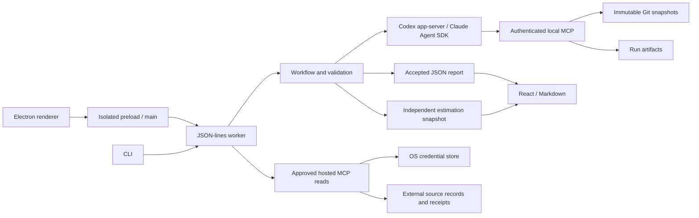

# Architecture and protocol



## Trust boundaries

The Electron renderer is sandboxed with no Node access; an allowlisted bridge connects it to the trusted worker. The worker handles repositories, normal Git authentication, provider authentication, and application data. Provider executables are trusted: tool restrictions do not contain a compromised runtime.

Source files, commit messages, branch names, and repository instructions are untrusted evidence. Authenticated, run-scoped tools enforce repository, snapshot, path, and approved external-read boundaries. Report validation checks structure and recorded evidence, but cannot guarantee the model's conclusions or eliminate prompt injection.

Local snapshots, external records, and reports may contain private data. Protect `AIDEN_HOME`; selected context and evidence are sent to the chosen provider. Integration credentials stay in the worker's credential store or session memory, outside project files, prompts, renderer persistence, receipts, and logs. Report vulnerabilities using the [security policy](../.github/SECURITY.md).

## Handoffs

1. **Understand** uses supplied intent and the previous baseline to propose requirements. Repository instructions cannot establish intent.
2. **Review** creates a versioned baseline. Existing IDs stay stable; retired IDs cannot be reused.
3. **Synchronize and discover** perform guarded fetch/fast-forward, record inventory, copy independent Git objects into the run directory, and select up to six distinct snapshots per repository. The default branch, or HEAD when unavailable, is required. Inventory is capped at 150 recent refs and disclosed.
4. **Assess** covers each reviewed requirement exactly once. Implementation status and deviation are separate. The tools record repository, SHA, path, and the exact lines returned by each evidence read.
5. **Report** summarizes accepted findings. The worker supplies the immutable identity envelope, validates the baseline, coverage, snapshots and evidence, then atomically replaces the latest pointer.
6. **Estimate** classifies original scope, optionally classifies retrieved history without dates, durations, or tracker points, and estimates remaining work against one accepted report. Its artifact is independently validated and published. The LLM explains touch points, testing difficulty, and risk. The LLM selects up to five analogous recent tickets with reasons, without seeing their timestamps or durations. Deterministic TypeScript validates their identities and matching size, work type, and scope shape before calculating duration. At least three dated matches are needed for an observed range and median. These durations include review and waiting; they are not added into a project finish date. Manual time and velocity inputs are retired; saved version-1 artifacts remain readable.

An artifact can receive two correction attempts. Valid completed stages are persisted and reused on resume. A failed/cancelled attempt cannot replace the latest accepted report. Concurrent operations on one project are rejected. A resumed stale run cannot overwrite a newer report or changed baseline. Model conclusions are not independently verified by these structural checks.

## JSON-lines interface, version 1.0

Start `pnpm worker` for development, or `node dist/packages/core/src/worker.js` after building. Production stdout contains only protocol messages. One request per line:

```json
{ "protocol": "1.0", "id": 1, "method": "report", "params": { "projectId": "my-project" } }
```

Response and asynchronous event examples:

```json
{"id":1,"result":{"runId":"RUN_ID"}}
{"event":{"type":"progress","runId":"RUN_ID","stage":"discover","message":"Discover…"}}
```

Errors use `{ "id": 1, "error": { "message": "..." } }`. Callers correlate replies by ID; run events carry run IDs.

| Method                                                               | Parameters                                    | Result                                                                                                                |
| -------------------------------------------------------------------- | --------------------------------------------- | --------------------------------------------------------------------------------------------------------------------- |
| `projects`                                                           | `{}`                                          | Saved projects                                                                                                        |
| `state`                                                              | `projectId`                                   | Project, baseline, runs, and `activeRunIds` this worker is executing                                                  |
| `prepare`                                                            | `project`                                     | `runId`; later `review` event                                                                                         |
| `candidate`                                                          | `projectId, runId`                            | Editable product/requirements                                                                                         |
| `approve`                                                            | `projectId, runId, product`                   | Reviewed baseline                                                                                                     |
| `updateRuntime`                                                      | `projectId, runtime`                          | Updates selected provider/auth/model                                                                                  |
| `report`                                                             | `projectId, browserCheck?`                    | `runId`; later completion/failure. `browserCheck` runs `verify` after a completed assessment when an app URL is saved |
| `answer`                                                             | `runId, questionId, answer`                   | Clarification accepted                                                                                                |
| `cancel`                                                             | `runId`                                       | Cancellation requested                                                                                                |
| `resume`                                                             | `projectId, runId`                            | Resumes saved handoffs                                                                                                |
| `result`                                                             | `projectId, runId?`                           | Validated report; latest if omitted                                                                                   |
| `export`                                                             | `projectId, runId, format, includeEstimates?` | Plain report or a matching report/estimate bundle                                                                     |
| `evidence`                                                           | `projectId, runId, index, evidenceIndex`      | Pinned cited lines                                                                                                    |
| `diagnostics`                                                        | `{}`                                          | Installed runtime and available auth states                                                                           |
| `setKey`                                                             | `provider, key`                               | Session-only key; never persist request lines                                                                         |
| `login`                                                              | `provider: "codex"`                           | Provider browser sign-in URL                                                                                          |
| `integrations` / `integrationAdd`                                    | connection metadata                           | List or add hosted MCP connections                                                                                    |
| `integrationConnect` / `integrationDisconnect` / `integrationRemove` | `connectionId`                                | Manage the trusted-worker connection                                                                                  |
| `integrationTools` / `integrationApprove` / `integrationCall`        | connection, tool selection, or read arguments | Discover, approve, and invoke read tools                                                                              |
| `updateSources`                                                      | `projectId, sources`                          | Select project context and one confirmed history source                                                               |
| `estimate` / `estimation`                                            | `projectId, reportId?`                        | Generate or retrieve a versioned estimate                                                                             |
| `estimateOverrides`                                                  | `projectId, overrides`                        | Publish recalculated size overrides and historical comparisons                                                        |
| `verify` / `verification`                                            | `projectId, url?` / `projectId, runId?`       | Browser-verify approved requirements; read the saved result                                                           |
| `verificationSettings` / `updateVerificationSettings`                | `projectId` / `projectId, url \| null`        | Read or save the project's app URL for verification                                                                   |

Runtime errors are redacted. Raw provider stderr and raw model streams are not forwarded into progress logs. Protocol traces containing `setKey` or authentication responses must never be recorded.

## Browser verification (prototype)

`verify` tests each approved requirement against a running web app in a recorded Playwright Chromium session. It never reads, builds, or runs repository code. Each project can save its own app URL (the App URL button on the project overview in the desktop app, or `verify-url` in the CLI) through `verificationSettings` and `updateVerificationSettings`. It is stored in the project's owner-only `verification.json`, and `verify` uses it when no URL is passed. In the desktop app, Refresh status sends `report` with `browserCheck`, so the worker starts `verify` once the assessment completes and an app URL is saved. Check now in the App URL panel starts `verify` alone. Open full report asks the main process to open the report path that `verification` returns, so the renderer never supplies a file path. The Watch recording pop-up loads videos and screenshots through `aiden:verificationMedia`, which serves only files named in that run's saved result, from its verification folder, as bytes the renderer turns into blob URLs. The overview combines both sources per requirement: a browser pass or fail with recorded evidence sets the headline state, and Couldn't verify leaves the code status in charge. A check of an earlier baseline is never attached to the current requirements. The renderer only ever receives the URL and saved results, never test credentials. A URL must be a loopback host (`localhost`, `127.0.0.1`, `[::1]`, or `*.localhost`), the origin of the saved app URL, or an origin listed exactly in `verification.json` `allowedOrigins`. Navigations to any other origin are blocked, and the agent is returned to the app.

Each requirement is one criterion. An attempt opens a fresh browser context with video on, then the provider runs `workflows/v1/verify-criterion.md` against a run-scoped MCP server with these tools: observe (screenshot plus accessibility snapshot), click, type, select, press, navigate, a credential-typing tool, and `page_check`. Every step records its action, one-line reasoning, and screenshot. A step cap (25 by default) ends the attempt as "Couldn't verify: step limit reached." Clicks whose target reads as delete, remove, pay, purchase, send, or similar are refused.

A pass needs a cited passing `page_check` and a separate screenshot review (`workflows/v1/verify-vision.md`) that sees only the outlined proof screenshot and agrees. When the signals disagree, the result is "Couldn't verify: signals disagree." A fail or an unverified attempt runs once more in a fresh browser. When the two runs disagree, the result is "Couldn't verify: inconsistent results." Requirements that only happen on a server become "Couldn't verify: not testable in the UI."

Optional test credentials come from `AIDEN_VERIFY_USERNAME` and `AIDEN_VERIFY_PASSWORD` or a `verification.json` with mode 600 in the project folder. The agent types them through a tool by name and never sees them. Password fields are masked in video and screenshots, and every saved string is redacted. The run folder gets `verification/report.html`, `results.json`, and per-attempt videos and screenshots. The report opens each video at the proof timestamp.

## Hosted MCP boundary

Hosted MCP connections run only in the worker. Streamable HTTP is preferred; legacy HTTP/SSE is a compatibility fallback. OAuth uses discovery, PKCE, state validation, and a temporary loopback callback. OAuth and bearer credentials use the OS credential store through `@napi-rs/keyring`, with an explicit session-only fallback. Files contain connection metadata, approved tool names, and definition fingerprints only.

Tools with a known write-shaped name, a destructive annotation, or no positive read signal stay disabled. Users approve a specific read list. A changed name, description, input schema, or read classification changes the fingerprint and clears approval. The agent receives one brokered `external_read` operation limited to connections selected by the project; it never receives credentials or arbitrary configured servers.

History collection records raw source responses and hashed tool-call receipts. It stops after 500 issues or 100 calls and reports incomplete pagination. Valid observed duration requires both start and completion timestamps. Completion-only items cannot support a duration estimate. External completion state is context and never code-implementation evidence.

## Git policy

The trusted service passes argument arrays, validates repository roots, disables hooks/fsmonitor/external diff/submodule recursion, checks executable filter configuration **before status**, and skips unsupported checkout requirements. A normal configured Git credential helper or SSH agent still works in this service. The agent receives no Git credential tools or shell.

Fetch is followed by a second cleanliness/HEAD check, ancestry validation, and `merge --ff-only --no-autostash`. Aiden never switches branches, stashes, resets, rebases, pushes, or resolves conflicts. There is no transaction with external editors; Git's own locks and the preflight checks protect routine use, but users should avoid simultaneous branch operations during synchronization.

Independent bare snapshot repositories retain commit objects for history and evidence viewing without relying on the source checkout. This can use substantial disk space in large projects; snapshot retention/deduplication is future work.

## Runtime configuration

Claude runs with built-in tools removed, no project settings/plugins, strict Aiden-only MCP configuration, and explicit subscription or API-key authentication. Subscription mode checks Claude's structured status, then checks SDK account metadata before releasing the prompt. Credentials stay in Claude's normal profile, while API-key execution uses an isolated profile and an explicitly supplied key. Both modes replace the child environment with an allowlist; neither falls back to the other. Its initialization tool list is checked before proceeding.

Codex uses an ephemeral app-server thread, a restricted named filesystem profile, disabled shell/web/browser/plugin/app/multi-agent features, zero project-instruction loading, and the Aiden MCP server. Inherited MCP servers are disabled and thread-specific MCP inventory is checked. The installed app-server model catalog selects the default model. Its auth is checked against the explicitly selected method.

The provider process still connects to its model service. These policies restrict agent tools; they are not a sandbox around compromised provider runtime code. OS/VM containment is deferred to the Firecracker phase.

## Models and local schedules

Model catalogs are queried under the selected authentication profile; these checks submit no assessment prompt and do not switch billing modes. API keys are session-only. A custom or saved model ID remains selected if catalog discovery fails.

Electron owns daily/weekly local schedules and persists preferences in `AIDEN_HOME/preferences/schedules.json`. Aiden must stay open and awake. Missed or busy slots are skipped; clock or timezone changes recalculate the next occurrence. The time slot is persisted before work starts, and the engine's project lock prevents overlapping operations. A pending requirements review blocks unattended analysis. Scheduled clarification cancels the run for manual review. Disabling a schedule stops future runs; cancelling active work is a separate action. Session-only API keys must be supplied again after restarting.
