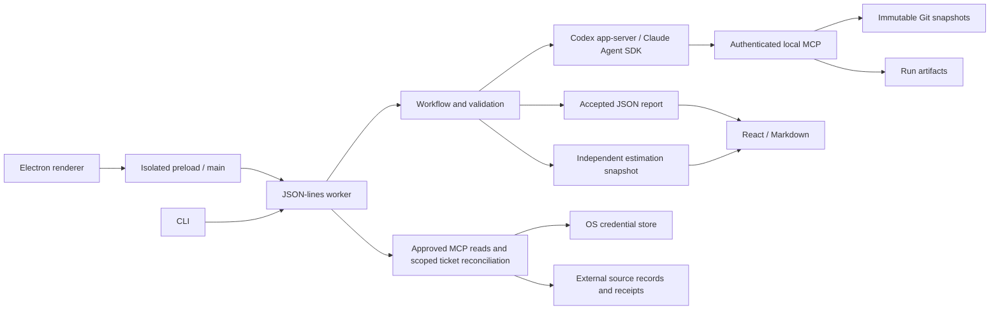

# Architecture and protocol



## Trust boundaries

The Electron renderer is sandboxed with no Node access; an allowlisted bridge connects it to the trusted worker. The worker handles repositories, normal Git authentication, provider authentication, and application data. Provider executables are trusted: tool restrictions do not contain a compromised runtime.

Source files, commit messages, branch names, and repository instructions are untrusted evidence. Authenticated, run-scoped tools enforce repository, snapshot, path, and approved external-read boundaries. Report validation checks structure and recorded evidence, but cannot guarantee the model's conclusions or eliminate prompt injection. During assessment, repo_pull_requests may search pull requests on a selected repository's github.com remote through GitHub's public API, without credentials; each request carries the repository name and search text, and results are untrusted leads, never evidence of merged code.

Local snapshots, external records, and reports may contain private data. Protect `AIDEN_HOME`; selected context and evidence are sent to the chosen provider. Integration credentials stay in the worker's credential store or session memory, outside project files, prompts, renderer persistence, receipts, and logs. Report vulnerabilities using the [security policy](../.github/SECURITY.md).

## Handoffs

1. **Understand** uses supplied intent, the previous baseline, and answered calls to write what done means: requirements, up to six edge cases each (IDs `E1`, `E2`, ... per requirement), an ordered `deliveryPlan` of vertical features or justified platform work, and calls a person must make, each explicitly classified as blocking or non-blocking. Each feature owns requirement IDs exactly once and names hard prerequisite feature IDs that must appear earlier. Contract validation rejects missing ownership, duplicate identities, unknown references, self-dependencies, cycles, and invalid order. Existing products without a plan remain readable. Unknown core behavior pauses affected requirements and transitive dependents. Unclassified legacy decisions conservatively block. Rewrites retain unresolved blockers even if the model omits them. Only reversible, low-impact choices may proceed on supported assumptions. Repository instructions cannot establish intent. Retired requirement IDs and dangling call references are sent back to the model for correction.
2. **Commit** creates a versioned baseline. The desktop app commits it without a review step (`prepare` with `autoAccept`); the CLI still stops for `approve`. Existing IDs stay stable; retired IDs cannot be reused. Open calls the rewrite no longer raises are dropped. Generated baselines record a hash of the answered decisions used to produce them, alongside the understand checkpoint. Before a desktop look, changed answers trigger a rewrite, including after worker restart; legacy baselines fall back to answer timestamps.
3. **Synchronize and choose commits** reads each project's selected remote branch, fetches its exact SHA into a private ref, and copies independent Git objects into the run directory. It never fast-forwards the user's checkout or substitutes a local default branch for remote evidence. The initial choice is the current branch's upstream, or its same-named branch on origin/the sole remote, and is persisted per project repository. Detached HEAD or ambiguous remotes require selection. Missing or inaccessible branches leave branch verification unknown. The picker lists live heads with guarded Git, and saving validates exact remote membership under both project and browser locks. It clears current report, estimate, verification and watcher pointers while retaining historical artifacts. A look reads only the repositories the baseline names (`product.repositories`); without that list it reads them all. Fresh remote snapshots are selected for assessment; unavailable remotes retain explicitly local progress snapshots. Provenance and observation time are saved in `discover.json` and the validated report. Older reports remain readable with merge verification unknown.
4. **Assess** selects freshly fetched selected remote-branch commits without moving local HEAD, tracking branches, or working files. Local and legacy snapshots can describe progress but never establish merged delivery; unavailable remotes leave merge verification unknown. Remote branch presence does not prove PR merge history, deployment, or acceptance-test success. Each remote snapshot records its observation time. Assessment covers each reviewed requirement exactly once. Implementation status and deviation are separate. The tools record repository, SHA, path, and the exact lines returned by each evidence read.
5. **Report** summarizes accepted findings. The worker supplies the immutable identity envelope, validates the baseline, coverage, snapshots and evidence, then atomically replaces the latest pointer.
6. **Estimate** starts automatically after a successful desktop look when the baseline has a delivery plan. It uses the accepted report identity and the existing provider, consent, and cancellation boundaries. It classifies original scope, optionally classifies retrieved history without dates, durations, or tracker points, and estimates remaining work against one accepted report. Its artifact is independently validated and published. The LLM explains touch points, testing difficulty, and risk. The LLM selects up to five analogous recent tickets with reasons, without seeing their timestamps or durations. Deterministic TypeScript validates their identities and matching size, work type, and scope shape before calculating duration. At least three dated matches are needed for an observed range and median. These durations include review and waiting; they are not added into a project finish date. Manual time and velocity inputs are retired; saved version-1 artifacts remain readable.

An artifact can receive two correction attempts. Valid completed stages are persisted and reused on resume. A failed/cancelled attempt cannot replace the latest accepted report. Concurrent operations on one project are rejected. A resumed stale run cannot overwrite a newer report or changed baseline. Model conclusions are not independently verified by these structural checks.

## JSON-lines interface, version 1.0

Start `pnpm worker` for development, or `node dist/packages/core/src/worker.js` after building. Production stdout contains only protocol messages. One request per line:

```json
{ "protocol": "1.0", "id": 1, "method": "report", "params": { "projectId": "my-project" } }
```

Response and asynchronous event examples:

```json
{"id":1,"result":{"runId":"RUN_ID"}}
{"event":{"type":"progress","runId":"RUN_ID","stage":"discover","message":"Discover…"}}
```

Errors use `{ "id": 1, "error": { "message": "..." } }`. Callers correlate replies by ID; run events carry run IDs.

| Method                                                               | Parameters                                    | Result                                                                                                                |
| -------------------------------------------------------------------- | --------------------------------------------- | --------------------------------------------------------------------------------------------------------------------- |
| `projects`                                                           | `{}`                                          | Saved projects                                                                                                        |
| `state`                                                              | `projectId`                                   | Project, baseline, runs, and `activeRunIds` this worker is executing                                                  |
| `prepare`                                                            | `project, autoAccept?`                        | `runId`; later `review` event, or with `autoAccept` a committed baseline and then a look                              |
| `candidate`                                                          | `projectId, runId`                            | Editable product/requirements                                                                                         |
| `approve`                                                            | `projectId, runId, product`                   | Reviewed baseline                                                                                                     |
| `updateRuntime`                                                      | `projectId, runtime`                          | Updates selected provider/auth/model                                                                                  |
| `report`                                                             | `projectId, browserCheck?`                    | `runId`; later completion/failure. `browserCheck` runs `verify` after a completed assessment when an app URL is saved |
| `look`                                                               | `projectId, reason?`                          | `runId` of a fresh code assessment followed by automatic sizing for planned scope; interrupted runs remain in history |
| `activity` / `calls`                                                 | `projectId`                                   | The action log, newest first; every call, oldest first                                                                |
| `answerCall`                                                         | `projectId, callId, answer`                   | Answered call and the `runId` it started, or null when Aiden is busy and uses it on the next look                     |
| `editIntent`                                                         | `projectId, context \| product`               | `runId` of the rewrite (context) or look (product) that follows                                                       |
| `heads`                                                              | `projectId`                                   | Current commits read with guarded Git, whether they changed since the last look, and when that look started           |
| `cancel`                                                             | `runId`                                       | Cancellation requested                                                                                                |
| `resume`                                                             | `projectId, runId`                            | Resumes saved handoffs                                                                                                |
| `result`                                                             | `projectId, runId?`                           | Validated report; latest if omitted                                                                                   |
| `export`                                                             | `projectId, runId, format, includeEstimates?` | Plain report or a matching report/estimate bundle                                                                     |
| `evidence`                                                           | `projectId, runId, index, evidenceIndex`      | Pinned cited lines                                                                                                    |
| `diagnostics`                                                        | `{}`                                          | Installed runtime and available auth states                                                                           |
| `setKey`                                                             | `provider, key`                               | Session-only key; never persist request lines                                                                         |
| `login`                                                              | `provider: "codex"`                           | Provider browser sign-in URL                                                                                          |
| `integrations` / `integrationAdd`                                    | connection metadata                           | List or add hosted MCP connections                                                                                    |
| `integrationConnect` / `integrationDisconnect` / `integrationRemove` | `connectionId`                                | Manage the trusted-worker connection                                                                                  |
| `integrationTools` / `integrationApprove` / `integrationCall`        | connection, tool selection, or read arguments | Discover, approve, and invoke read tools                                                                              |
| `updateSources`                                                      | `projectId, sources`                          | Select project context and one confirmed history source                                                               |
| `estimate` / `estimation`                                            | `projectId, reportId?`                        | Generate or retrieve a versioned estimate                                                                             |
| `estimateOverrides`                                                  | `projectId, overrides`                        | Publish recalculated size overrides and historical comparisons                                                        |
| `verify` / `verification`                                            | `projectId, url?` / `projectId, runId?`       | Browser-verify approved requirements; read the saved result                                                           |
| `verificationSettings` / `updateVerificationSettings`                | `projectId` / `projectId, url \| null`        | Read or save the project's app URL for verification                                                                   |

Runtime errors are redacted. Raw provider stderr and raw model streams are not forwarded into progress logs. Protocol traces containing `setKey` or authentication responses must never be recorded.

## Browser verification (prototype)

`verify` tests each approved requirement and edge case against a running web app in a recorded Playwright Chromium session. It never reads, builds, or runs repository code. Each project can save its own app URL (**Settings → Project** in the desktop app, or `verify-url` in the CLI) through `verificationSettings` and `updateVerificationSettings`. It is stored in the project's owner-only `verification.json`, and `verify` uses it when no URL is passed. After a look's code assessment completes, the worker uses the saved URL or discovers a local app (`packages/verification/src/discover.ts`): one HEAD request per candidate port on `localhost`, with no redirects followed and nothing started. Successful HTML pages become suggestions in an `app-url` call; even one page requires confirmation. API errors and redirects are excluded. Before checking, a no-tools triage turn (`workflows/v1/triage.md`) decides for each requirement and edge case whether to check it in the app, through the API, in the code, or by a person, and who to act as; at most 30 app checks run per look, main paths first. Open full report asks the main process to open the report path that `verification` returns, so the renderer never supplies a file path. The Watch recording pop-up loads videos and screenshots through `aiden:verificationMedia`, which serves only files named in that run's saved result, from its verification folder, as bytes the renderer turns into blob URLs. The overview combines both sources per requirement: a browser pass or fail with recorded evidence sets the headline state, and Couldn't verify leaves the code status in charge. A check of an earlier baseline is never attached to the current requirements. The renderer only ever receives the URL and saved results, never test credentials. A URL must be a loopback host (`localhost`, `127.0.0.1`, `[::1]`, or `*.localhost`), the origin of the saved app URL, or an origin listed exactly in `verification.json` `allowedOrigins`. Navigations to any other origin are blocked, and the agent is returned to the app.

Each requirement is one criterion. An attempt opens a fresh browser context with video on, then the provider runs `workflows/v1/verify-criterion.md` against a run-scoped MCP server with these tools: observe (screenshot plus accessibility snapshot), click, type, select, press, navigate, a credential-typing tool, and `page_check`. Every step records its action, one-line reasoning, and screenshot. A step cap (25 by default) ends the attempt as "Couldn't verify: step limit reached." Clicks whose target reads as delete, remove, pay, purchase, send, or similar are refused.

A pass needs a cited passing `page_check` and a separate screenshot review (`workflows/v1/verify-vision.md`) that sees only the outlined proof screenshot and agrees. When the signals disagree, the result is "Couldn't verify: signals disagree." A fail or an unverified attempt runs once more in a fresh browser. When the two runs disagree, the result is "Couldn't verify: inconsistent results." HTTP-observable backend requirements use API checks when configured; internal storage properties need a person or an integration test.

API checks use `verification.json`'s optional `api: { url, allowMutations }` setting, editable through the same public settings RPC. The API base is independent of the app URL and is never discovered automatically. API-only projects can verify without a browser app URL. A stopped browser app does not abort configured API checks. `ApiHttp` confines requests to the configured origin and path prefix, refuses redirects and URL-carried secrets, bounds response size and duration, and defaults to read-only methods. Opting into writes authorizes a disposable environment; prompts restrict mutations to data created during the attempt. This is not deterministic per-resource ownership enforcement. Secret handles keep configured credentials, generated identities, and returned tokens in the worker.

`ApiSession` records sanitized HTTP receipts and trusted assertions into an inert local HTML page rendered by Chromium. The model cannot edit the page. The existing media contract serves its recording and screenshots through Watch. `verify-api-review.md` independently judges full criterion coverage from the recorded transcript, with no tools or agent conclusion. Incomplete evidence is unverified. API attempts run once to avoid replaying writes. Unverified results become report-scoped manual confirmation actions; failing results remain developer actions. `verification-attempt.ts` shares attempt lifecycle and evidence rules, while `verification-workflow.ts` plans and publishes results.

Optional test credentials come from `AIDEN_VERIFY_USERNAME` and `AIDEN_VERIFY_PASSWORD` or a `verification.json` with mode 600 in the project folder. The agent types them through a tool by name and never sees them. Password fields are masked in video and screenshots, and every saved string is redacted. The run folder gets `verification/report.html`, `results.json`, and per-attempt videos and screenshots. The report opens each video at the proof timestamp.

## Hosted MCP boundary

Hosted MCP connections run only in the worker. Streamable HTTP is preferred; legacy HTTP/SSE is a compatibility fallback. OAuth uses discovery, PKCE, state validation, and a temporary loopback callback. OAuth and bearer credentials use the OS credential store through `@napi-rs/keyring`, with an explicit session-only fallback. Files contain connection metadata, approved tool names, and definition fingerprints only.

For analyst access, tools with a known write-shaped name, a destructive annotation, or no positive read signal stay disabled. Users approve a specific read list. A changed name, description, input schema, or read classification changes the fingerprint and clears approval. The agent receives one brokered `external_read` operation limited to connections selected by the project; it never receives credentials or arbitrary configured servers.

The desktop offers Linear for new integration setup. Jira and custom MCP are experimental and hidden for new connections and project selections; saved connections and existing project links remain manageable. Their worker contracts and adapters are retained for compatibility and future testing.

Automatic ticket delivery is a separate deterministic worker capability. `ticketCapabilities`, `ticketState`, `saveTicketSettings`, and `syncTickets` expose bounded setup and observations to the desktop. Project settings pin a Linear team/project or Jira site/project/type and the exact discovered tool fingerprint. Only create, content update, GET, and marker search operations are supported; `external_read` never gains writes. Tool listing follows pagination; changed contracts require review. Jira updates use document-format descriptions. Unsupported arguments stop before mutations.

`projects/<id>/tickets.json` atomically stores settings, feature identities, content hashes, remote observations, pending writes, and reconciliation errors. Syncs coalesce in-process and hold the project filesystem lock against other workers and scope runs. The reconciler publishes vertical features in plan order and links prerequisite issues in the body. It persists a pending content hash and recovery marker before mutation, saves returned identity immediately, and GETs independently to verify scope, marker, and content. Ambiguous creates use marker search plus GET recovery only; an empty search does not authorize repeating an uncertain create. Removed features retain their external issues. Reusing a retired feature ID requires a new ID.

Every minute while the desktop is open, the watcher reconciles idle projects. Successful automatic preparation and code checks also sync. New remote status changes persist an assessment request; a completed code report started after the change clears it. Tracker Done is never acceptance evidence. Detected manual content edits cause a visible conflict; remote tools provide no atomic compare-and-swap, so a simultaneous edit between the preflight read and write can still race. Human status and assignment are never written. Polling observes current state, so intermediate transitions between polls are not an event history. A person can pause publishing offline. Recovery cannot infer a missing destination, supply required custom fields, bypass account permissions, or automatically resolve a conflict. No live credentials or tracker account are needed for the synthetic hosted-MCP regression tests.

History collection records raw source responses and hashed tool-call receipts. It stops after 500 issues or 100 calls and reports incomplete pagination. Valid observed duration requires both start and completion timestamps. Completion-only items cannot support a duration estimate. External completion state is context and never code-implementation evidence.

## Git policy

The trusted service passes argument arrays, validates repository roots, disables hooks/fsmonitor/external diff/submodule recursion, checks executable filter configuration **before status**, and skips unsupported checkout requirements. A normal configured Git credential helper or SSH agent still works in this service. The agent receives no Git credential tools or shell.

Fetch is followed by a second cleanliness/HEAD check, ancestry validation, and `merge --ff-only --no-autostash`. Aiden never switches branches, stashes, resets, rebases, pushes, or resolves conflicts. There is no transaction with external editors; Git's own locks and the preflight checks protect routine use, but users should avoid simultaneous branch operations during synchronization.

Independent bare snapshot repositories retain commit objects for history and evidence viewing without relying on the source checkout. This can use substantial disk space in large projects; snapshot retention/deduplication is future work.

## Runtime configuration

Claude runs with built-in tools removed, no project settings/plugins, strict Aiden-only MCP configuration, and explicit subscription or API-key authentication. Subscription mode checks Claude's structured status, then checks SDK account metadata before releasing the prompt. Credentials stay in Claude's normal profile, while API-key execution uses an isolated profile and an explicitly supplied key. Both modes replace the child environment with an allowlist; neither falls back to the other. Its initialization tool list is checked before proceeding.

Codex uses an ephemeral app-server thread, a restricted named filesystem profile, disabled shell/web/browser/plugin/app/multi-agent features, zero project-instruction loading, and the Aiden MCP server. Inherited MCP servers are disabled and thread-specific MCP inventory is checked. The installed app-server model catalog selects the default model. Its auth is checked against the explicitly selected method.

The provider process still connects to its model service. These policies restrict agent tools; they are not a sandbox around compromised provider runtime code. OS/VM containment is deferred to the Firecracker phase.

## Models and watching

Model catalogs are queried under the selected authentication profile; these checks submit no assessment prompt and do not switch billing modes. API keys are session-only. A custom or saved model ID remains selected if catalog discovery fails.

Electron's watcher (`apps/desktop/src/watcher.ts`) checks each project with a baseline every minute while Aiden is open. It asks the worker for `heads`, which runs a guarded `git rev-parse HEAD` per repository (no fetch, no checkout change), and starts a `look` when a commit differs from the one the last look started from. It also starts one morning look after 08:00 local time unless Aiden already looked that day, recording the day in `AIDEN_HOME/preferences/watch.json`. It never starts a look while any run is active, starts at most one per check, and reports repeated failures once. Session-only API keys must be supplied again after restarting.

Every run writes an action log to `runs/<id>/activity.jsonl` (owner-only, append-only, symlinks refused) and streams each line as an `activity` event. Lines are redacted for test credentials and clipped. Runs saved before the log existed get a minimal timeline rebuilt from their manifests and labeled as such. Why? on a log line opens that run's conversation, saved in `runs/<id>/chat.json` (`chat`, `explain`, `askWhy`). A line with a recorded reason is answered from it without a model turn. Other questions go to `workflows/v1/ask-why.md` with the run's log, its report findings or browser checks (including step times for the recording), and the conversation so far; the turn uses the project's runtime and billing, has no tools, and takes no project lock. Calls live in `projects/<id>/calls.json`; the `request_clarification` tool records blocking status and directs the model to pause affected work. Code assessment receives only independent requirements; blocked rows are enforced as unknown without executable remaining work. Browser/API checks skip blocked requirements, and total sizing pauses. Answers update scope and release work. Planning and assessment runs save local feature tickets as `tickets.md`; the UI derives current tickets from saved scope, evidence, and calls.

### External coding delivery and beta reconciliation

Coding jobs are separate from analyst runs. The per-project `codingAgentEnabled` beta setting is off unless explicitly true. The worker checks opt-in and unresolved blockers before worktree or runtime side effects. An explicit desktop dispatch then creates an isolated Git worktree using the guarded Git wrapper, then launches the installed Claude Code through its SDK. Claude Code owns the coding loop, standard tools, automatic permission decisions, local tests and PR creation. This is a distinct capability from the tool-restricted analyst runtime described above. Project/plugin/MCP settings remain disabled; the selected authentication mode is checked before releasing the task. Git safety configuration is inherited by the child. A worktree isolates edits, not operating-system access; Claude Code's permission system governs its tools. Aiden does not grant permission bypass mode or implement a shell/tool loop.

Jobs persist their scope, repository, branch, Claude session ID, selected runtime, terminal outcome and reported local checks. A terminal result is never requirement verification. Aiden independently validates GitHub PR repository, source/target branch and merge state. Completion triggers reconciliation; the desktop watcher also reconciles every minute, even while analyst work is active. Interruptions preserve the worktree and never silently redispatch paid coding work. Starting another coding task remains explicit.

Opt-in beta verification runs hourly or daily while the desktop app is open. The public beta settings contain a same-origin HTTPS revision endpoint returning a full deployed Git commit. Aiden waits for merge and confirms that revision equals or contains the merge commit through GitHub. Each verification run has a preallocated ID persisted on its job, avoiding duplicate launches after interrupted status updates. Beta results publish only after checking the revision again; changed deployments invalidate the run. Evidence identifies beta and its revision. Local test execution is delegated to the external coding agent. Existing explicit CLI verification commands remain available for isolated evaluations; normal project assessments never discover or verify localhost automatically.

### Linear destination setup

The desktop loads team names and stable IDs lazily through the allowlisted `linearTeams` worker operation. `publishLinearTickets` accepts a saved Aiden project, a selected team, and reviewed tool contracts. The worker derives the Linear project name from saved scope, validates the issue and project capabilities, and verifies team availability before creating anything. It persists a pending project marker before creation, reads the project back to verify its identity and team, then authorizes ticket publishing into that destination. Retries search for the original marker and refuse another create after an uncertain attempt. Separate Aiden projects keep separate markers even when names match. Existing configured destinations remain stable.

Linear setup operations have a narrow, typed adapter for team listing, project search/read, and project creation. They do not expose arbitrary writes, project deletion, or workflow transitions to analysts. Live server contracts are checked against supported argument shapes; synthetic MCP tests exercise creation, read-back, uncertain replies, foreign teams, changed contracts, and duplicate prevention.

Project monitoring API: `monitoring(projectId)` initializes and returns saved selections; `remoteBranches(projectId, repositoryId)` lists live remote heads and safe connection warnings; `updateMonitoredBranch(projectId, repositoryId, monitoredBranch)` saves a validated `{remote, branch}` selection. Desktop branch changes then start a fresh look. Resuming an old run after its monitored branch changed is rejected. New report snapshots use `source: remote-branch`; legacy `remote-default` remains readable.

### Human acceptance and project closure

`acceptOutcome(projectId, note, evidenceKey)`, `closeProject(projectId, note)`, and `reopenProject(projectId)` maintain a separate `lifecycle.json` journal. Projects without it remain active. `projects` and `state` return derived lifecycle metadata; input project metadata cannot overwrite the journal. Acceptance binds to saved intent, repository selections, baseline, report/verification pointers, calls, and manual confirmations. Stale submissions are rejected; new evidence makes the previous acceptance historical. These actions never rewrite assessment verdicts or external tracker states.

Decisions acquire the code, browser, and delivery locks and reject active coding sessions. The worker prevents decisions from crossing in-flight project writes. Closed projects are skipped by the watcher, tracker reconciliation, delivery reconciliation, and detached follow-up scheduling. Run start/resume checks trusted lifecycle storage under the run lock, so stale renderer requests cannot restart closed projects. Reopening retains monitoring settings and makes the project eligible for the next watcher tick.
