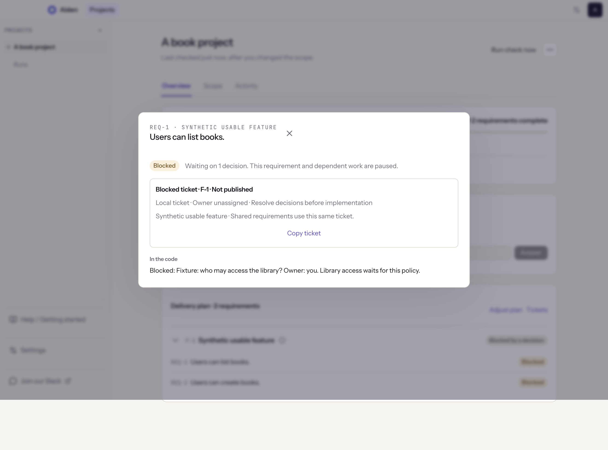

# Daily workflow

Aiden keeps everyone clear on what done means, where it stands, when it will land, and what’s in the way. Start in Overview for the answer, then open a requirement when you want to see what’s behind it.

## What does done mean?

Scope holds what you’re building and how you’ll know it works. Refine it as you learn; Aiden checks the work again. Keep delivery steps usable and testable, including a concrete test plan for foundation work that other steps depend on.

## Where does it stand?

Overview shows progress, what’s left, and what needs your attention. Each requirement is one line with one status; hover the status to see how Aiden knows, and open the line for its checks, evidence, linked ticket, and next actions. A delivery step's outcome and rationale sit behind its (i) button. Activity shows what changed and why. Runs has the details of each check.

While Preview is open, Aiden watches the selected remote branch every minute and checks again when pushed code changes. It also checks each morning if no check has run that day. Use Run check now in the project header to start a fresh assessment from current code. Interrupted checks stay in history; this action does not resume their old snapshots.

With automatic tickets enabled, Aiden checks tracker status every minute while the project is idle. A status change prompts a new code assessment, as does the first successful read of an already completed or canceled ticket. Saving scope and finishing an assessment also reconcile tickets. Sync tickets does this on demand.

## When will it land?

Expand Progress details and estimates to see how much work remains and the reasoning behind the estimate. When comparable delivery history is available, Aiden uses it to estimate how long the remaining work could take. When evidence or history is insufficient, the forecast stays unavailable.

## What’s in the way?

Needs you brings the decisions that need your judgment. Answer the question to unlock affected work and its dependents. Independent investigation can continue while another part waits for a decision.

Delivery attention shows where the work and the agreed outcome have come apart. Checking completion means a fresh assessment is running. Completion unverified means Aiden still needs evidence or an acceptance check. Delivery deviation means it found missing, partial, or contradictory work. Open the finding to see the issue, the evidence, any dependent steps it affects, and what to do next.

## Accept the outcome

Use **Accept outcome** from the project menu, or from the card that appears once every requirement is done, when you are satisfied with the result. Add a note explaining what you reviewed and any remaining gaps you accept. Aiden labels the decision **Manually accepted** and keeps it in **Decision history**. Automated completion counts, failed checks, deviations, and unverified requirements retain their results. Acceptance does not merge a PR or close tracker tickets.

Acceptance applies to the current scope, monitored branches, saved checks, and manual confirmations. Changed scope or new evidence requires a fresh review; the previous decision stays in history. Monitoring continues after acceptance.

Review the checks and available recordings before accepting the result. Product decides whether it meets the intent; engineering signs off on how it was built. New code may need another manual check even when the previous version passed.

A closed ticket does not verify its requirements. Moving it back to In Progress prompts another assessment; it does not erase an implementation mismatch. Aiden does not automatically close a ticket just because code appears.

The selected branch tells you which pushed code Aiden checked. Work on that branch may still need to be merged or deployed. App and API checks show the behavior they could actually observe. Missing access stays unverified, including repository, tracker, app, API, and deployment access.

## Keep the project connected

If a tracker needs attention, reconnect the existing connection in Settings → Integrations, then open Tickets on the project's delivery plan and use Sync tickets. Publishing settings, in the same pop-up, lets you check the team and destination or pause automatic publishing. Restore access or supply the requested check, then let Aiden look again.

## Close and reopen a project

Use **Close project** from the project menu, add a closing note, and confirm when you want Aiden to stop following the project. You can also close an unfinished or cancelled initiative without accepting its outcome. Closing pauses automatic code checks, delivery monitoring, and ticket syncing. It preserves reports, requirements, decisions, and external tracker statuses. Active work must finish or be stopped before closing.

Find the project under **Closed projects** in the sidebar. Open it to read its history, then choose **Reopen project** to resume monitoring with its existing settings. The next scheduled check can run while Aiden is open. Closing and reopening never automatically merge code or change a Linear project's status.
